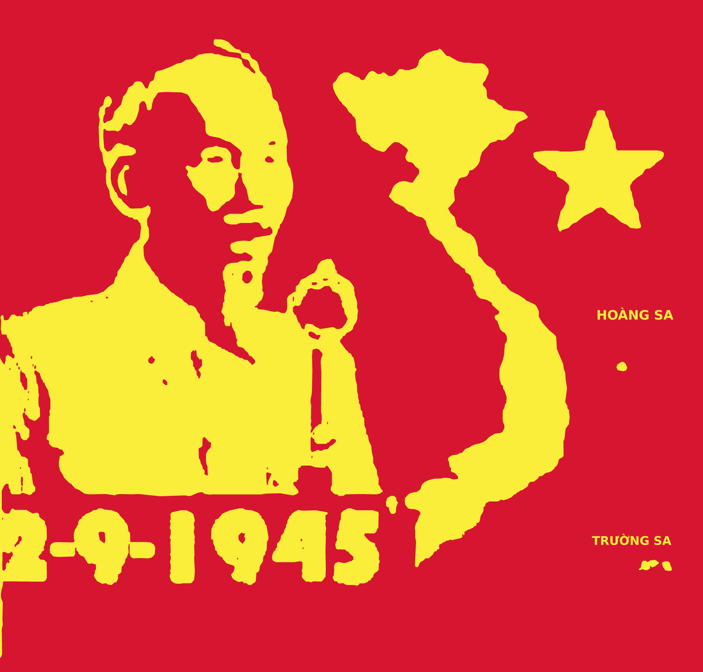
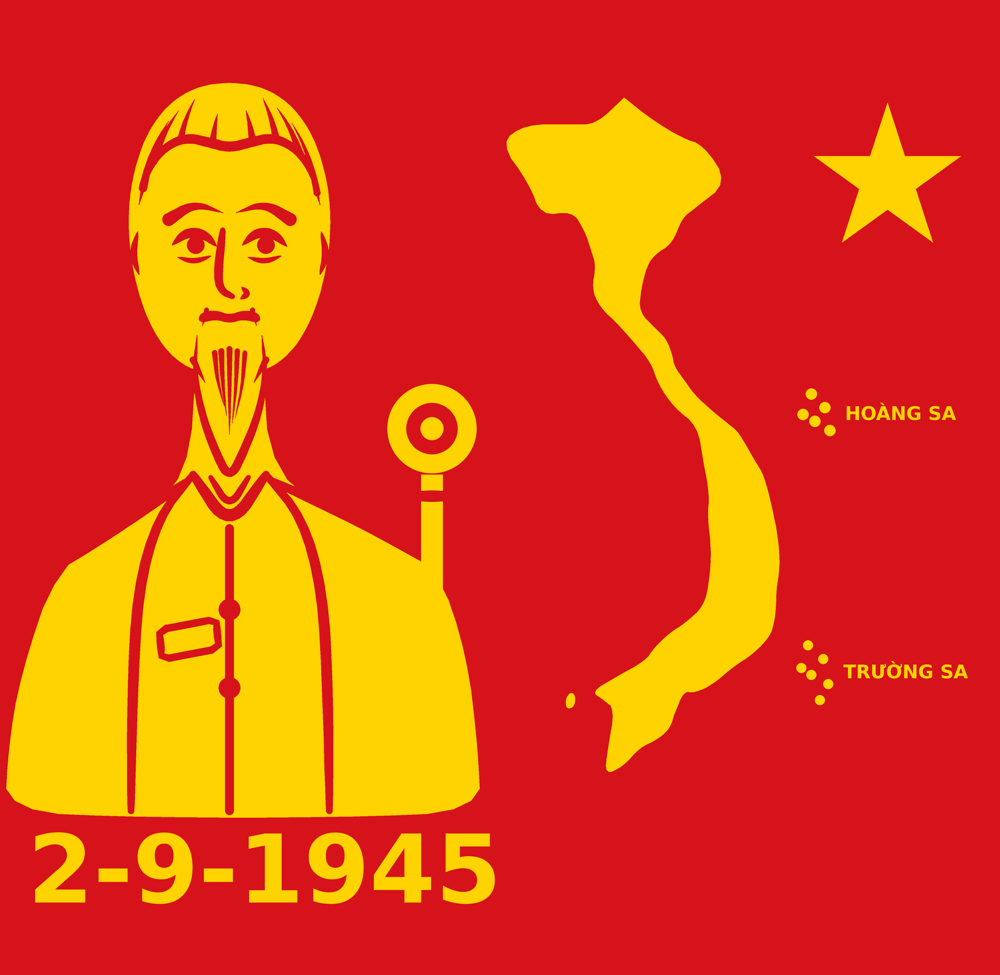

# 2-9-1945

Các chương trình Python vẽ hình về ngày Chủ tịch Hồ Chí Minh đọc bản Tuyên
ngôn Độc lập tại Quảng trường Ba Đình, mồng 2 tháng 9 năm 1945.

Bản đầu vạch nét từ ảnh chụp một bức tranh tường nên đường nét giống hệt bản
vẽ tay; hai bản sau sinh hình hoàn toàn bằng mã.

## 1. Vạch nét thẳng từ ảnh bức tranh tường — `vach_net_tu_anh.py` + `ve_theo_tuong.py`

Cách cho ra đường nét **giống hệt bản vẽ tay trên tường**: lấy chính bức ảnh
chụp làm gốc, vạch lấy đường biên rồi dựng lại thành vector.



```bash
pip install pillow numpy scikit-image
python3 vach_net_tu_anh.py anh_chup.jpg -o net_tranh_tuong.json   # vạch nét
python3 ve_theo_tuong.py -o tranh.png                             # vẽ lại
python3 ve_theo_tuong.py -o tranh.svg                             # bản vector
```

Tệp `net_tranh_tuong.json` đã có sẵn trong kho (50 hình, hơn 1500 điểm) nên
chỉ cần Pillow là vẽ lại được; bước vạch nét chỉ chạy khi muốn đổi ảnh gốc.

**Bốn bước của `vach_net_tu_anh.py`:**

1. **Tìm khung tranh.** Lọc các điểm ảnh đỏ hoặc vàng đậm, khớp đường thẳng
   cho mép trái và mép phải để suy ra bốn góc bức tranh trong ảnh chụp.
2. **Nắn phẳng.** Phép biến đổi phối cảnh đưa bốn góc ấy về một hình chữ
   nhật, khử độ nghiêng của máy ảnh.
3. **Tách hai màu.** Chuyển sang hệ màu HSV rồi lấy vùng vàng theo sắc màu —
   nhờ vậy các vạch tối của cánh cửa cuốn và những vệt loá không lọt vào.
   Mặt nạ được dọn bằng các phép hình thái học.
4. **Vạch biên và giản lược.** Dò biên bằng marching squares (chính xác dưới
   một điểm ảnh) rồi giản lược bằng Douglas-Peucker. Màu của mỗi đường biên
   xác định bằng cách lấy mẫu ngay bên trong nó; các hình xếp theo diện tích
   giảm dần nên chỗ lồng nhau như vành micro hay con ngươi đều đúng.

Hai nhãn *Hoàng Sa* và *Trường Sa* trong ảnh quá nhỏ để vạch cho ra chữ đọc
được, nên vùng ấy được bỏ qua khi vạch nét và vẽ lại bằng phông chữ.

| Tuỳ chọn của `ve_theo_tuong.py` | Ý nghĩa |
|---|---|
| `-o`, `--output` | Tên tệp xuất ra; đuôi `.svg` thì xuất bản vector |
| `--net` | Tệp dữ liệu đã vạch nét (mặc định `net_tranh_tuong.json`) |
| `--rong` | Bề rộng ảnh xuất ra (mặc định `2000`) |
| `--mau` | `tuong` (màu đo từ bức tường) hoặc `co` (theo mẫu quốc kỳ) |
| `--khong-chu` | Bỏ hai nhãn Hoàng Sa và Trường Sa |
| `--cua-cuon` | Thêm vạch ngang mô phỏng cánh cửa cuốn |

Mép trái bức ảnh gốc bị khuôn hình cắt mất một phần chữ *2* và cánh tay, nên
bản vạch nét cũng thiếu đúng phần đó.

### Quay lại quá trình — `quay_qua_trinh.py`

Dựng một đoạn phim đi qua đúng sáu bước trên, mỗi khung hình lấy từ kết quả
thật của bước ấy chứ không dàn dựng: ảnh chụp, bốn góc tìm được, cảnh nắn
phẳng xoay dần về hình chữ nhật, mặt nạ vùng vàng hiện ra, các đường biên
được dò lần lượt, rồi hình vector được tô từ lớn đến nhỏ.

```bash
pip install imageio imageio-ffmpeg
python3 quay_qua_trinh.py anh_chup.jpg -o qua_trinh.mp4
python3 quay_qua_trinh.py anh_chup.jpg -o qua_trinh.gif --nhanh 1.6
```

| Tuỳ chọn | Ý nghĩa |
|---|---|
| `-o`, `--output` | Tệp phim xuất ra, `.mp4` hoặc `.gif` |
| `--fps` | Số khung hình mỗi giây (mặc định `25`) |
| `--nhanh` | Hệ số tua nhanh, `2` là phim ngắn đi một nửa |

Bản dựng sẵn: [`qua_trinh_dung_tranh.mp4`](qua_trinh_dung_tranh.mp4) — 18,5 giây.

## 2. Tranh cổ động hai màu vẽ hoàn toàn bằng mã — `ve_tranh_co_dong.py`

Vẽ theo lối tranh tường quen thuộc: nền đỏ cờ, hình vàng phẳng, không tô
bóng. Bên trái là chân dung Bác bên chiếc micro, bên phải là bản đồ Việt
Nam kèm quần đảo Hoàng Sa và Trường Sa, góc trên là ngôi sao năm cánh,
phía dưới là dòng chữ 2-9-1945.



```bash
pip install pillow
python3 ve_tranh_co_dong.py                       # ảnh PNG rộng 2000 điểm ảnh
python3 ve_tranh_co_dong.py -o tranh.svg          # bản vector, sắc nét ở mọi cỡ
```

| Tuỳ chọn | Ý nghĩa |
|---|---|
| `-o`, `--output` | Tên tệp xuất ra; đuôi `.svg` thì xuất bản vector |
| `--rong` | Chiều rộng ảnh tính bằng điểm ảnh (mặc định `2000`) |
| `--ty-le` | Hệ số siêu lấy mẫu khi vẽ ảnh điểm (mặc định `3`) |
| `--chu` | Dòng chữ phía dưới (mặc định `2-9-1945`) |
| `--mau` | `tuong` (màu đo từ bức tường) hoặc `co` (theo mẫu quốc kỳ) |
| `--seed` | Hạt giống cho nhịp tay vẽ của các lọn tóc và sợi râu (mặc định `29`) |
| `--cua-cuon` | Thêm vạch ngang mô phỏng cánh cửa cuốn nơi vẽ tranh tường |

### Vì sao hình sắc nét

- **Xuất được bản vector.** Cùng một hình học, `TranhSVG` ghi thẳng ra các
  thẻ `polygon`, `circle`, `text` nên phóng to bao nhiêu cũng không vỡ nét;
  đem in khổ lớn hay mở bằng trình vẽ vector để sửa đều được.
- **Thu ảnh bằng phép lấy trung bình theo ô.** Bản PNG vẽ lớn gấp `--ty-le`
  lần rồi thu về bằng `Image.reduce` với hệ số nguyên. Các phép nội suy như
  LANCZOS sinh quầng sáng dọc bờ hình giữa hai màu tương phản mạnh, còn
  phép trung bình theo ô thì không, nên bờ hình vừa mượt vừa gọn.
- **Bảng màu đo từ chính bức tường**: đỏ hơi ngả son `#d61630`, vàng chanh
  `#faee3a` — không phải vàng nghệ như bảng màu mặc định thường thấy.

### Thuật toán vẽ

Bốn ý chính khiến nét vẽ ra dáng bút lông chứ không phải đường máy tính:

1. **Bo cong bằng phép cắt góc Chaikin** (`lam_muot`). Mỗi lượt thay một đỉnh
   bằng hai điểm nằm trên hai cạnh kề, cạnh gãy biến thành cung cong. Ba
   lượt là đủ mượt mà vẫn giữ dáng hình. Đường bờ biển chỉ bo hai lượt nên
   dáng chữ S mềm lại mà các mũi đất không bị mài tròn.
2. **Nét có bề rộng thay đổi** (`than_net`). Thay vì vẽ đường thẳng bề rộng
   cố định, chương trình dựng đa giác bao quanh đường: đi hết mép trái rồi
   vòng ngược mép phải, bề rộng tại mỗi điểm lấy theo một dáng bút —
   `bung` (phình giữa), `vuot` (vuốt nhọn dần về cuối), `nhon` (nhọn cả hai
   đầu), `deu` (đều). Lông mày, sợi râu, lọn tóc đều vuốt nhọn như thật.
3. **Lọn tóc sinh theo hình cầu hộp sọ** (`_lon_toc`). Hộp sọ được xấp xỉ
   bằng một hình cầu dẹt; mỗi lọn xuất phát từ một điểm trên chân tóc rồi
   vừa dâng lên đỉnh (bán kính tăng) vừa xoay dần về giữa (góc thu lại),
   nên các lọn chạy song song ôm lấy hộp sọ thay vì chụm vào một điểm.
   Chòm râu cũng sinh theo cách tương tự, toả từ cằm rồi chụm về chóp râu.
4. **Nhịp tay vẽ**. Vị trí, chiều dài và độ đậm của từng lọn tóc, sợi râu
   được xê dịch ngẫu nhiên trong biên độ hẹp, lấy từ một hạt giống cố định
   (`--seed`) nên cùng hạt giống thì cùng một bức tranh, đổi hạt giống thì
   được một bản chép tay khác.

Ngoài ra:

- **Bản đồ dựng từ toạ độ thật.** Danh sách `DAT_LIEN` ghi các điểm mốc
  trên biên giới và bờ biển theo (kinh độ, vĩ độ), hàm `_diem_ban_do()`
  chiếu thẳng vào ô chứa bản đồ nên dáng chữ S đúng tỉ lệ. Hai quần đảo
  giữ đúng vĩ độ, còn hoành độ được kéo lại gần cho vừa khuôn hình.
- Lớp `KhungVe` gom phần chung của hai kiểu xuất: mọi hình đều quy về mảng,
  đường tròn và chữ, nên bản PNG và bản SVG luôn giống hệt nhau.

## 3. Ảnh tư liệu dựng bằng bản đồ độ cao — `ve_bac_ho_doc_tuyen_ngon.py`

Bản thử theo hướng khác: dựng một bản đồ độ cao cho toàn cảnh (hộp sọ, gò
má, sống mũi, thân áo, micro), tính pháp tuyến bề mặt rồi chiếu sáng từng
điểm ảnh, sau đó phủ hiệu ứng ảnh chụp năm 1945 — hạt phim, ám nâu, tối
bốn góc, khung viền.

```bash
pip install pillow numpy
python3 ve_bac_ho_doc_tuyen_ngon.py --chu-thich
```

| Tuỳ chọn | Ý nghĩa |
|---|---|
| `-o`, `--output` | Tên tệp ảnh xuất ra |
| `--che-do` | `sepia` (ảnh cũ) hoặc `xam` (đen trắng) |
| `--hat` | Độ đậm hạt phim, `0` là tắt |
| `--chu-thich` | In thêm dòng chú thích dưới ảnh |
| `--seed` | Hạt giống ngẫu nhiên cho hạt phim và vết xước |

Cách này cho chất liệu và khối nổi, nhưng vì hình học dựng bằng các khối
cơ bản nên kết quả vẫn ở mức tranh dựng máy, không đạt độ giống ảnh chụp.
Bản tranh cổ động ở trên hợp với cách vẽ bằng mã hơn.
