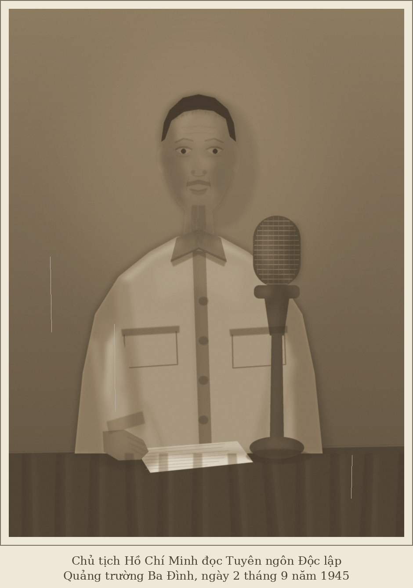

# Bác Hồ đọc Tuyên ngôn Độc lập

Một đoạn mã Python dựng lại bức ảnh tư liệu **Chủ tịch Hồ Chí Minh đọc bản
Tuyên ngôn Độc lập tại Quảng trường Ba Đình, ngày 2 tháng 9 năm 1945**.

Toàn bộ hình được vẽ từ các hình khối cơ bản — đa giác, ellipse, đường cong —
không dùng ảnh gốc làm nguyên liệu. Sau khi dựng hình, chương trình phủ thêm
các hiệu ứng của một tấm ảnh chụp năm 1945: nhoè nhẹ, hạt phim, ám màu nâu
sepia, tối bốn góc và khung viền ảnh in thủ công.



## Cài đặt

```bash
pip install pillow
```

## Chạy

```bash
python3 ve_bac_ho_doc_tuyen_ngon.py
```

Ảnh được lưu thành `tuyen_ngon_doc_lap.png`.

### Các tuỳ chọn

| Tuỳ chọn | Ý nghĩa |
|---|---|
| `-o`, `--output` | Tên tệp ảnh xuất ra (mặc định `tuyen_ngon_doc_lap.png`) |
| `--che-do` | Tông màu: `sepia` (ảnh cũ, mặc định), `xam` (đen trắng), `mau` (giữ nguyên màu vẽ) |
| `--hat` | Độ đậm của hạt phim, `0` là tắt hẳn (mặc định `1.0`) |
| `--ty-le` | Hệ số siêu lấy mẫu, càng lớn nét càng mịn và càng chậm (mặc định `3`) |
| `--chu-thich` | In thêm dòng chú thích dưới ảnh |
| `--seed` | Hạt giống ngẫu nhiên cho nếp vải, sợi râu, hạt phim (mặc định `1945`) |

Ví dụ, bản đen trắng sạch hạt kèm chú thích:

```bash
python3 ve_bac_ho_doc_tuyen_ngon.py --che-do xam --hat 0 --chu-thich -o bandentrang.png
```

## Cách chương trình dựng hình

Ảnh được vẽ trên khung `900 x 1200`, phóng to gấp `--ty-le` lần rồi thu nhỏ
lại để khử răng cưa. Ba lớp chồng lên nhau:

- **Lớp hình** — màu nền của từng mảng: phông, mặt bàn, áo kaki, da, tóc, micro.
- **Lớp tối** — vùng bóng lớn, làm nhoè mạnh để tạo khối: nửa mặt trong bóng,
  hõm má, sườn áo, bóng người hắt lên phông.
- **Lớp nét** — các chi tiết nhỏ cần giữ rõ: nếp nhăn trán, mí mắt, khe môi,
  sợi râu, kẽ ngón tay, mép túi áo.

Thứ tự vẽ trong `ve_toan_bo()`: phông → bóng người → bàn → đầu và cổ → thân áo
(cổ áo trùm lên cổ) → chòm râu → tập bản thảo → bàn tay → micro, sau đó mới
hợp nhất các lớp và phủ hiệu ứng ảnh cũ.
